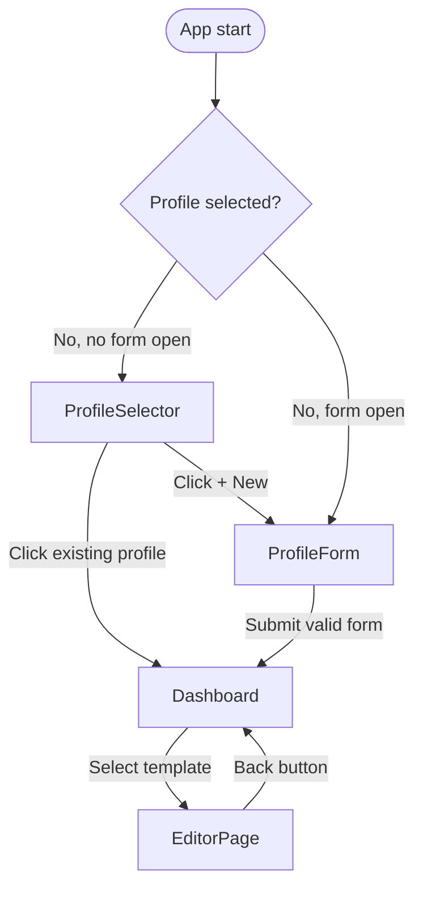

The React CV Builder & Exporter is a single-page application that lets you create, manage, and export professional CVs without a backend. You fill in your personal details, work history, education, and skills once, and the app stores everything in client-side state. From there you choose a visual template, preview the result, and download either a print-ready PDF or a JSON snapshot of your profile data — all in the browser.

## Key features

<CardGroup cols={2}>
  <Card title="Multi-profile management" icon="users">
    Create and switch between multiple named profiles. Each profile is stored in Zustand state and identified by a `crypto.randomUUID()` ID, so you can maintain separate CVs for different roles without re-entering data.
  </Card>
  <Card title="Two CV templates" icon="layout-template">
    Choose between the **Modern** and **Classic** templates. Both render from the same `Profile` data shape, so switching templates never requires re-entering information.
  </Card>
  <Card title="PDF export via html2pdf.js" icon="file-down">
    Exports the live DOM node with id `cv-preview` to an A4 portrait PDF at 2× canvas scale. The output filename is derived from the profile name and selected template (e.g. `jane-doe-modern.pdf`).
  </Card>
  <Card title="JSON export" icon="braces">
    Serializes the full `Profile` object to a formatted JSON file (e.g. `jane-doe.json`) using a `Blob` download. Useful for backing up data or importing into other tools.
  </Card>
  <Card title="Form validation with Zod" icon="shield-check">
    Every field in the profile form is validated by a `profileFormSchema` built with Zod v4. Errors surface inline per field. Date ranges are cross-validated so an end date cannot precede a start date.
  </Card>
  <Card title="Skill parsing" icon="tag">
    Technical and soft skills are entered as comma-separated strings and parsed into arrays at submission time. At least one entry in each category is required before the form can be saved.
  </Card>
</CardGroup>

## Tech stack

The application is built entirely with standard web tooling. The table below maps each concern to the library that handles it.

| Concern | Library | Version |
|---|---|---|
| UI framework | React | 18.3.1 |
| Language | TypeScript | — |
| Build tool | Vite | 6.3.5 |
| Styling | Tailwind CSS | 4.1.12 |
| Global state | Zustand | 5.0.8 |
| Form validation | Zod | 4.1.5 |
| PDF export | html2pdf.js | 0.10.3 |
| Notifications | react-toastify | 11.0.5 |
| Icons | lucide-react | 0.487.0 |

<Note>
The project uses pnpm with a Vite override pinned to `6.3.5`. If you install with npm, the same version constraint applies via the `devDependencies` field.
</Note>

## Three-view navigation flow

The app does not use a router for its primary navigation. Instead, `App.tsx` holds a `view` state variable (`'welcome' | 'editor' | 'about'`) and conditionally renders one of three views based on profile selection state from the Zustand store.



### ProfileSelector

Displayed when `selectedProfileId` is `null` and `showForm` is `false`. It lists all existing profiles as avatar buttons showing the first two initials of the profile name, plus a `+` button that opens the `ProfileForm`.

### Dashboard

Shown after a profile is selected. Greets the user by first name and renders the `DocumentCards` component, which lets them pick the **Modern** (`'modern'`) or **Classic** (`'classic'`) template. Selecting a card sets `template` state and transitions `view` to `'editor'`.

### EditorPage

Renders a full-page CV preview using either `ModernTemplate` or `ClassicTemplate` fed with the active `Profile`. A dropdown in the toolbar lets you switch templates without going back. The `ExportButtons` component in the same toolbar triggers PDF or JSON downloads.

## App state flow

All profile data lives in a single Zustand store (`useProfileStore`). The store is not persisted to `localStorage` by default, so data resets on page reload.

```typescript
interface ProfileStore {
  profiles: Profile[];           // All created profiles
  selectedProfileId: string | null;
  showForm: boolean;
  addProfile: (profile: Profile) => void;
  selectProfile: (profileId: string) => void;
  openForm: () => void;
  closeForm: () => void;
  goBack: () => void;            // Clears selectedProfileId → returns to ProfileSelector
}
```

`ProfileForm` validates form values with `profileFormSchema.safeParse`, maps the result to a `Profile` via `createProfileFromValues`, and calls `addProfile`. On success, `showForm` is set to `false` and the new profile becomes available in `ProfileSelector`.

<Tip>
Because state is in-memory only, exporting your profile as JSON before closing the tab lets you preserve your data for future sessions.
</Tip>
