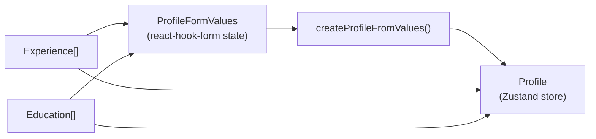

The CV Builder application is built around four TypeScript interfaces defined in `src/app/types.ts`. Understanding these types is essential for extending the application, writing custom export logic, or integrating with external services. Two interfaces — `Experience` and `Education` — describe individual CV entries, while `Profile` aggregates them into a complete document. `ProfileFormValues` mirrors `Profile` but uses raw form-friendly strings for skills, allowing `react-hook-form` to manage field state before the data is normalized.

## Interface overview

<CardGroup cols={2}>
  <Card title="Profile" icon="user">
    The top-level document stored in Zustand state. Contains all personal information, experience, education, and parsed skill arrays.
  </Card>
  <Card title="ProfileFormValues" icon="pen-to-square">
    The raw form state managed by `react-hook-form`. Skills are kept as comma-separated strings until `createProfileFromValues` normalizes them.
  </Card>
  <Card title="Experience" icon="briefcase">
    Represents a single work history entry. Used as an array element inside both `Profile` and `ProfileFormValues`.
  </Card>
  <Card title="Education" icon="graduation-cap">
    Represents a single academic entry. Structurally similar to `Experience` but without a `descripcion` field.
  </Card>
</CardGroup>

## Profile

`Profile` is the canonical data shape persisted in the Zustand store. Every profile is assigned a unique identifier on creation using `crypto.randomUUID()`. The `habilidades` object groups technical and soft skills as string arrays after the comma-separated form input has been parsed.

```typescript src/app/types.ts
export interface Profile {
  id: string;
  nombre: string;
  correo: string;
  numero: string;
  fechaNacimiento: string;
  experiencia: Experience[];
  educacion: Education[];
  habilidades: {
    tecnicas: string[];
    blandas: string[];
  };
}
```

<ResponseField name="id" type="string" required>
  A universally unique identifier generated via `crypto.randomUUID()` at the time the profile is created. Used as the primary key in the Zustand profiles array and for `selectProfile` lookups.
</ResponseField>

<ResponseField name="nombre" type="string" required>
  The person's full name. Trimmed of leading and trailing whitespace before storage.
</ResponseField>

<ResponseField name="correo" type="string" required>
  Email address. Must pass Zod's `z.email()` validation before the profile is created.
</ResponseField>

<ResponseField name="numero" type="string" required>
  Phone number. Accepts digits and the symbols `+`, `-`, spaces, and parentheses. Minimum 8 characters.
</ResponseField>

<ResponseField name="fechaNacimiento" type="string" required>
  Date of birth stored as an ISO 8601 date string (e.g., `"1990-04-15"`). Cannot be a future date.
</ResponseField>

<ResponseField name="experiencia" type="Experience[]" required>
  Array of work experience entries. Empty experience rows entered in the form are filtered out before storage. See the [Experience interface](#experience) below.
</ResponseField>

<ResponseField name="educacion" type="Education[]" required>
  Array of education entries. Blank rows are filtered out before storage. See the [Education interface](#education) below.
</ResponseField>

<ResponseField name="habilidades" type="object" required>
  <Expandable title="properties">
    <ResponseField name="tecnicas" type="string[]" required>
      Array of technical skills parsed from the comma-separated `habilidadesTecnicas` form field. At least one entry is required.
    </ResponseField>
    <ResponseField name="blandas" type="string[]" required>
      Array of soft skills parsed from the comma-separated `habilidadesBlandas` form field. At least one entry is required.
    </ResponseField>
  </Expandable>
</ResponseField>

## Experience

Each entry in `Profile.experiencia` conforms to the `Experience` interface. All fields are stored as plain strings; date comparison for validation is performed lexicographically on ISO date strings.

```typescript src/app/types.ts
export interface Experience {
  empresa: string;
  puesto: string;
  inicio: string;
  fin: string;
  descripcion: string;
}
```

<ResponseField name="empresa" type="string" required>
  The company or organization name. Required when any other field in the entry has been filled in.
</ResponseField>

<ResponseField name="puesto" type="string" required>
  The job title or role. Required when any other field in the entry has been filled in.
</ResponseField>

<ResponseField name="inicio" type="string" required>
  Start date as an ISO 8601 date string (e.g., `"2021-03-01"`). Required when any other field is present.
</ResponseField>

<ResponseField name="fin" type="string" required>
  End date as an ISO 8601 date string. Must be on or after `inicio`. Required when any other field is present.
</ResponseField>

<ResponseField name="descripcion" type="string">
  Free-text description of responsibilities or achievements for the role. Optional — an entry is not invalidated if this field is empty.
</ResponseField>

## Education

The `Education` interface tracks academic history. It is structurally similar to `Experience` but omits the `descripcion` field since degrees do not typically carry a freeform description in this application.

```typescript src/app/types.ts
export interface Education {
  institucion: string;
  titulo: string;
  inicio: string;
  fin: string;
}
```

<ResponseField name="institucion" type="string" required>
  Name of the university, school, or training institution. Required when any other field in the entry has been filled in.
</ResponseField>

<ResponseField name="titulo" type="string" required>
  The degree, diploma, or certificate title (e.g., `"Licenciatura en Ingeniería Informática"`). Required when any other field is present.
</ResponseField>

<ResponseField name="inicio" type="string" required>
  Start date as an ISO 8601 date string. Required when any other field is present.
</ResponseField>

<ResponseField name="fin" type="string" required>
  End date as an ISO 8601 date string. Must be on or after `inicio`. Required when any other field is present.
</ResponseField>

## ProfileFormValues

`ProfileFormValues` is the shape that `ProfileForm` manages in local `useState`. It is nearly identical to `Profile` except that `id` is absent (generated on save) and both skill fields are single strings rather than arrays, making them compatible with a standard `<textarea>` element.

```typescript src/app/types.ts
export interface ProfileFormValues {
  nombre: string;
  correo: string;
  numero: string;
  fechaNacimiento: string;
  experiencia: Experience[];
  educacion: Education[];
  habilidadesTecnicas: string;
  habilidadesBlandas: string;
}
```

<ResponseField name="nombre" type="string" required>
  Full name. Identical to `Profile.nombre`.
</ResponseField>

<ResponseField name="correo" type="string" required>
  Email address. Identical to `Profile.correo`.
</ResponseField>

<ResponseField name="numero" type="string" required>
  Phone number. Identical to `Profile.numero`.
</ResponseField>

<ResponseField name="fechaNacimiento" type="string" required>
  Date of birth. Identical to `Profile.fechaNacimiento`.
</ResponseField>

<ResponseField name="experiencia" type="Experience[]" required>
  Work experience entries. The form renders one row per entry; blank rows are preserved until `createProfileFromValues` filters them.
</ResponseField>

<ResponseField name="educacion" type="Education[]" required>
  Education entries. Same behavior as `experiencia` regarding blank row filtering.
</ResponseField>

<ResponseField name="habilidadesTecnicas" type="string" required>
  A single comma-separated string of technical skills (e.g., `"React, TypeScript, Node.js"`). Split into `Profile.habilidades.tecnicas` by `createProfileFromValues`.
</ResponseField>

<ResponseField name="habilidadesBlandas" type="string" required>
  A single comma-separated string of soft skills (e.g., `"Comunicación, Trabajo en equipo"`). Split into `Profile.habilidades.blandas` by `createProfileFromValues`.
</ResponseField>

<Note>
  `ProfileFormValues` intentionally omits `id`. The profile identifier is only generated at save time inside `createProfileFromValues` using `crypto.randomUUID()`, ensuring that each profile received by the store is always unique regardless of how many times the form is submitted or reset.
</Note>

## Type relationships

The diagram below shows how the four types relate to one another through the profile creation flow:



<Tip>
  When adding a new field to the CV, add it to both `Profile` and `ProfileFormValues`, then update `profileFormSchema` in `src/app/schemas/profile.ts` and the normalization logic in `createProfileFromValues` to handle the new field.
</Tip>
